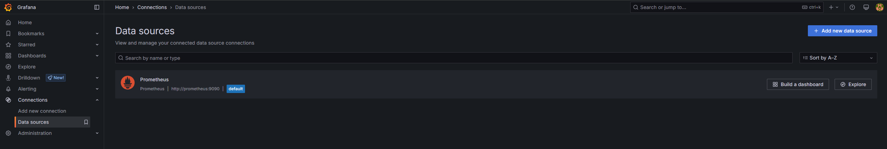
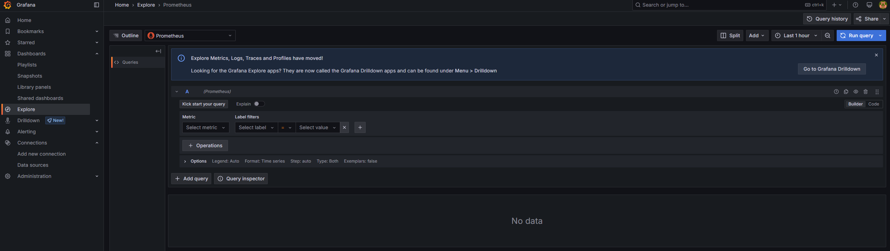

# OpenTelemetry Hello World

This repository is intended to be used to demonstrate some of the capabilities of the OpenTelemetry collector.

Before following the instructions below you must install the following prerequisites:

- kind
- docker
- helm
- kubectl

## Set-up

To set up the demo run:
```
./set-up.sh
```

This script carries out the following steps:

- Creates a local kind cluster called `otel-hello-world`
- Starts `cloud-controller-manager` as a container process. This will automatically set up port forwarding to the grafana service.
- Installs the `observability` helm chart in the `observability` namespace. This installs the following subcharts:
    - OpenTelemetry Operator - this will be used to manage collector instances
    - Prometheus - this will be used as the grafana data source and will be the service the OpenTelemetry collector will send data to
    - Grafana - this will expose an endpoint through which you will be able to access a grafana dashboard and view the collected metrics
- Waits for the pods to be in a running state and outputs the URL to access the grafana dashboard

Run 
```
kubectl get all -n observability
``` 

You should see a similar output to this:

```
NAME                                 READY   STATUS    RESTARTS   AGE
pod/grafana-59c55c4bbb-h4q4f         1/1     Running   0          30m
pod/otel-operator-6564db5875-fdq2h   2/2     Running   0          30m
pod/prometheus-7d54f99957-9k6f6      1/1     Running   0          30m

NAME                            TYPE           CLUSTER-IP      EXTERNAL-IP   PORT(S)             AGE
service/grafana                 LoadBalancer   10.96.125.188   172.19.0.5    80:31054/TCP        30m
service/otel-operator           ClusterIP      10.96.19.195    <none>        8443/TCP,8080/TCP   30m
service/otel-operator-webhook   ClusterIP      10.96.97.51     <none>        443/TCP             30m
service/prometheus              ClusterIP      10.96.174.195   <none>        9090/TCP            30m

NAME                            READY   UP-TO-DATE   AVAILABLE   AGE
deployment.apps/grafana         1/1     1            1           30m
deployment.apps/otel-operator   1/1     1            1           30m
deployment.apps/prometheus      1/1     1            1           30m

NAME                                       DESIRED   CURRENT   READY   AGE
replicaset.apps/grafana-59c55c4bbb         1         1         1       30m
replicaset.apps/otel-operator-6564db5875   1         1         1       30m
replicaset.apps/prometheus-7d54f99957      1         1         1       30m
```

Follow the URL given in the set-up scripts output to access the grafana dashboard. The username is `admin` and the password is `password123`.

Once logged in, navigate to `Connections` > `Data sources` and you should see the following:


The default Prometheus data source should already be set-up for you.

From this page click `Explore` next to the Prometheus data source.

You should see the following:


If you click on the `Select metric` dropdown, you will see there are no metrics available. This is expected.

In the next section, we will see this dropdown populated by installing a dummy app on the cluster and then create a OpenTelemetry collector to collect metrics from it.

This concludes the set-up steps.

## Installing the dummy app and configuring a new collector

